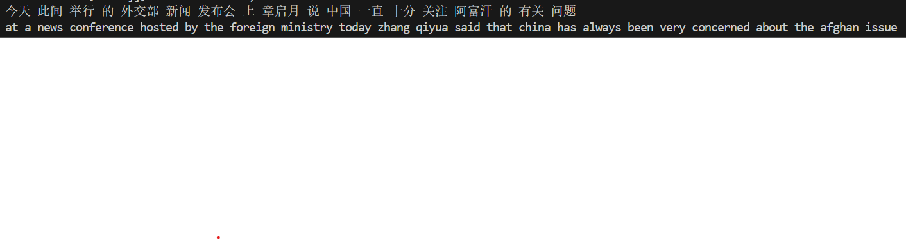

# Transformer test for minor English-Chinese conversions
This repository contains the implementation of English-Chinese conversions, project inspired by https://zhuanlan.zhihu.com/p/581334630. But I made some changes to that base, modifying the Transformer's code to make it look more like a traditional Transformer, and my modifications incorporate pytorch's Transformer source code
## dataset
A little dataset with Chinese and English. We all know that Transformer works better on large datasets, so this is just a test, ultimately our model works pretty well on the test set, currently you can use our model to train on larger datasets, which will take more time and arithmetic, we are just a test!
## Result

## Model
A traditional Transformer
